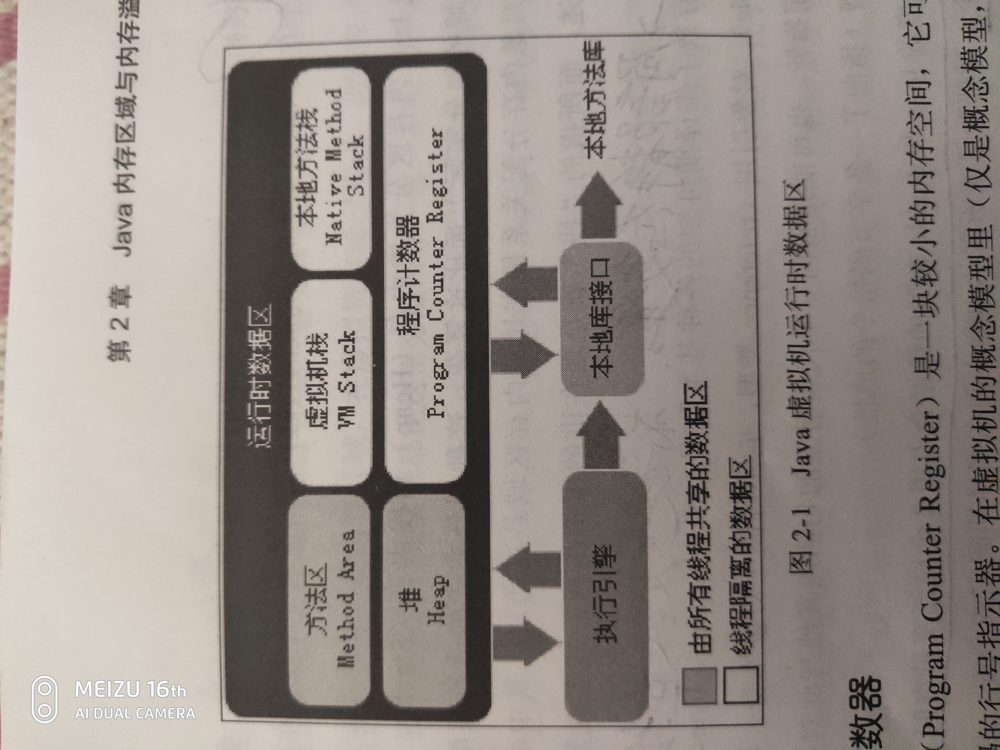

# Java内存区域与内存溢出异常
### 运行时数据区域

### 程序计数器(Program Counter Regiser)
* 可以看作是当前线程所执行的字节码的行号指示器，在虚拟机的概念模型里，字节码解释器工作时就是通过改变这个计数器的值来选取下一条需要执行的字节码指令
* Java虚拟机的多线程是通过线程轮流切换并分配处理器执行时间的方式来实现的，在一个确定的时间，一个处理器（对于多核处理器来说是一个内核）都只会执行一条线程中的指令。因此，为了线程切换后能恢复到正确的执行位置，每条线程都需要有一个独立的程序计数器，各条线程之间计数器互不影响，独立存储。线程私有。
* Java方法，计数器记录的是正在执行的虚拟机字节码指令的地址。Native方法，计数器值为空
* 没有规定任何OutOfMemoryError的情况

JAVA方法: 是由JAVA编写的，编译成字节码，存储在class文件中
本地方法: 是由其它语言编写的，编译成和处理器相关的机器代码

### 虚拟机栈(Java Virtual Machine Stacks)
* 线程私有，生命周期与线程相同
* 虚拟机栈描述的是Java方法执行的内存模型：每个方法在执行的同时都会创建一个栈帧(Stack Frame)用于存储局部变量表，操作数栈，动态链接，方法出口等信息。每一个方法从调用直至执行完成的过程，就对应着一个栈帧在虚拟机中入栈到出栈的过程。
* 栈帧：https://www.cnblogs.com/minisculestep/articles/4934947.html
* 这个区域两张异常情况：如果线程请求的栈深度大于虚拟机所允许的深度，将抛出StackOverflowError异常；如果虚拟机栈可以动态扩展，若果扩展时无法申请到足够的内存，抛出OutOfMemoryError异常

### 本地方法栈(Native Method Stack)
* 虚拟机栈为虚拟机执行Java方法服务，而本地方法栈为Native方法服务

### 堆(heap)
* 所有线程共享，在虚拟机启动时创建
* 存放对象实例
* 是垃圾收集器管理的主要区域
* Java堆可以处于物理上不连续的内存空间中，只要逻辑上连续即可
* 在堆中没有内存完成实例分配，并且堆也无法再扩展时，将会抛出OutOfMemoryError异常

### 方法区(Method Area)
* 线程共享
* Java虚拟机规范把方法区描述为堆的一个逻辑部分
* 存储已被虚拟机加载的类信息、常量、静态变量、即时编译器编译后的代码等数据
* Java虚拟机规范对方法区的限制非常宽松，和堆一样不需要连续的内存和可以选择固定大小或者可扩展外，还可以选择不实现垃圾收集。
* 方法区无法满足内存分配需要时，抛出OutOfMemoryError异常
### 运行时常量池(Runtime Constant Pool)
* 方法区一部分
* Class文件中除了有类的版本、字段、方法、接口等描述信息外，还有一项信息是常量池，用于存放编译期生成的各种字面量和符号引用，这部分内容将在类加载后进入方法区的运行时常量池中存放
* 运行时常量池相对于Class文件常量池的另外一个重要特征是具备动态性，Java语言并不要求常量一定只有编译期才能产生，也就是并非预置入Class文件中常量池的内容才能进入方法区运行时常量池，运行期间也可能将新的常量放入池中。(String类的intern()方法：当调用 intern 方法时，如果池已经包含一个等于此 String 对象的字符串（用 equals(Object) 方法确定），则返回池中的字符串。否则，将此 String 对象添加到池中，并返回此 String 对象的引用。)
* 常量池无法再申请到内存时会抛出OutOfMemoryError异常
### 直接内存(Direct Memory)
* NIO(New Input/Output)类，引入了一种基于通道与缓冲区的I/O方式，它可以使用Native函数库直接分配堆外内存，然后通过一个存储在java堆中的DirectByteBuffer对象作为这块内存的引用进行操作。

