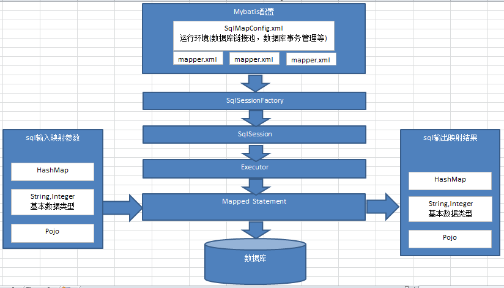

# Mybatis
### 1、JDBC
```
Public static void main(String[] args) {
    Connection connection = null;
    PreparedStatement preparedStatement = null;
    ResultSet resultSet = null;
    
    try {
        //加载数据库驱动
        Class.forName("com.mysql.jdbc.Driver");
        
        //通过驱动管理类获取数据库链接
        connection =  DriverManager.getConnection("jdbc:mysql://localhost:3306/mybatis?characterEncoding=utf-8", "root", "mysql");
        //定义sql语句 ?表示占位符
    String sql = "select * from user where username = ?";
        //获取预处理statement
        preparedStatement = connection.prepareStatement(sql);
        //设置参数，第一个参数为sql语句中参数的序号（从1开始），第二个参数为设置的参数值
        preparedStatement.setString(1, "王五");
        //向数据库发出sql执行查询，查询出结果集
        resultSet =  preparedStatement.executeQuery();
        //遍历查询结果集
        while(resultSet.next()){
            System.out.println(resultSet.getString("id")+"  "+resultSet.getString("username"));
        }
    } catch (Exception e) {
        e.printStackTrace();
    }finally{
        //释放资源
        if(resultSet!=null){
            try {
                resultSet.close();
            } catch (SQLException e) {
                // TODO Auto-generated catch block
                e.printStackTrace();
            }
        }
        if(preparedStatement!=null){
            try {
                preparedStatement.close();
            } catch (SQLException e) {
                // TODO Auto-generated catch block
                e.printStackTrace();
            }
        }
        if(connection!=null){
            try {
                connection.close();
            } catch (SQLException e) {
                // TODO Auto-generated catch block
                e.printStackTrace();
            }
        }

    }

}
```

### 2、Mybatis架构

1. 通过mybatis环境等配置信息构造SqlSessionFactory即会话工厂
2. 由会话工厂创建sqlSession即会话，操作数据库需要通过sqlSession进行。
3. mybatis底层自定义了Executor执行器接口操作数据库，Executor接口有两个实现，一个是基本执行器、一个是缓存执行器。
4. Mapped Statement也是mybatis一个底层封装对象，它包装了mybatis配置信息及sql映射信息等。mapper.xml文件中一个sql对应一个Mapped Statement对象，sql的id即是Mapped statement的id。
5. Mapped Statement对sql执行输入参数进行定义，包括HashMap、基本类型、pojo，Executor通过Mapped Statement在执行sql前将输入的java对象映射至sql中，输入参数映射就是jdbc编程中对preparedStatement设置参数。
6. Mapped Statement对sql执行输出结果进行定义，包括HashMap、基本类型、pojo，Executor通过Mapped Statement在执行sql后将输出结果映射至java对象中，输出结果映射过程相当于jdbc编程中对结果的解析处理过程。


### 3、Mybatis配置（不与Spring整合）
配置内容如下：
*   properties（属性）：db.properties
*   settings（全局配置参数）:全局配置参数，全局参数将会影响mybatis的运行行为
*   typeAliases（类型别名）:单个与批量
*   typeHandlers（类型处理器）：
*   objectFactory（对象工厂）：
*   plugins（插件）：
*   environments（环境集合属性对象）
*   environment（环境子属性对象）
*   transactionManager（事务管理）
*   dataSource（数据源）
*   mappers（映射器）：
```
<mapper resource=" " />
使用相对于类路径的资源
如：<mapper resource="sqlmap/User.xml" />

<mapper url=" " />
使用完全限定路径
如：<mapper url="file:///D:\workspace_spingmvc\mybatis_01\config\sqlmap\User.xml" />

<mapper class=" " />
使用mapper接口类路径
如：<mapper class="cn.itcast.mybatis.mapper.UserMapper"/>

注意：此种方法要求mapper接口名称和mapper映射文件名称相同，且放在同一个目录中。

<package name=""/>
注册指定包下的所有mapper接口
如：<package name="cn.itcast.mybatis.mapper"/>
注意：此种方法要求mapper接口名称和mapper映射文件名称相同，且放在同一个目录中。
```

MyBatis 将按照下面的顺序来加载属性：
*   在 properties 元素体内定义的属性首先被读取。 
*   然后会读取properties 元素中resource或 url 加载的属性，它会覆盖已读取的同名属性。 
*   最后读取parameterType传递的属性，它会覆盖已读取的同名属性。


SqlMapConfig.xml，此文件作为mybatis的全局配置文件，配置了mybatis的运行环境等信息。
mapper.xml文件即sql映射文件，文件中配置了操作数据库的sql语句,需要在SqlMapConfig.xml中加载。
```
<?xml version="1.0" encoding="UTF-8" ?>
<!DOCTYPE configuration
PUBLIC "-//mybatis.org//DTD Config 3.0//EN"
"http://mybatis.org/dtd/mybatis-3-config.dtd">
<configuration>
	<!-- 和spring整合后 environments配置将废除-->
	<properties resource="db.properties"/>
	<environments default="development">
		<environment id="development">
			<transactionManager type="JDBC"/>
			<dataSource type="POOLED">
				<property name="driver" value="${jdbc.driver}"/>
				<property name="url" value="${jdbc.url}"/>
				<property name="username" value="${jdbc.username}"/>
				<property name="password" value="${jdbc.password}"/>
			</dataSource>
		</environment>
	</environments>

    <mappers>
	<mapper resource="sqlmap/User.xml"/>
    </mappers>
</configuration>
```
测试程序：
```
public class Mybatis_first {
	//会话工厂
	private SqlSessionFactory sqlSessionFactory;

	@Before
	public void createSqlSessionFactory() throws IOException {
		// 配置文件
		String resource = "SqlMapConfig.xml";
		InputStream inputStream = Resources.getResourceAsStream(resource);

		// 使用SqlSessionFactoryBuilder从xml配置文件中创建SqlSessionFactory
		sqlSessionFactory = new SqlSessionFactoryBuilder()
				.build(inputStream);

	}

	// 根据 id查询用户信息
	@Test
	public void testFindUserById() {
		// 数据库会话实例
		SqlSession sqlSession = null;
		try {
			// 创建数据库会话实例sqlSession
			sqlSession = sqlSessionFactory.openSession();
			// 查询单个记录，根据用户id查询用户信息
			User user = sqlSession.selectOne("test.findUserById", 10);
			// 输出用户信息
			System.out.println(user);
		} catch (Exception e) {
			e.printStackTrace();
		} finally {
			if (sqlSession != null) {
				sqlSession.close();
			}
		}

	}

	// 根据用户名称模糊查询用户信息
	@Test
	public void testFindUserByUsername() {
		// 数据库会话实例
		SqlSession sqlSession = null;
		try {
			// 创建数据库会话实例sqlSession
			sqlSession = sqlSessionFactory.openSession();
			// 查询单个记录，根据用户id查询用户信息
			List<User> list = sqlSession.selectList("test.findUserByUsername", "张");
			System.out.println(list.size());
		} catch (Exception e) {
			e.printStackTrace();
		} finally {
			if (sqlSession != null) {
				sqlSession.close();
			}
		}

	}
}
```
**别名**
在mapper.xml中，定义很多的statement，statement需要parameterType指定输入参数的类型、需要resultType指定输出结果的映射类型。如果在指定类型时输入类型全路径，不方便进行开发，可以针对parameterType或resultType指定的类型定义一些别名，在mapper.xml中通过别名定义，方便开发。

在SqlMapConfig.xml中配置：
```
<typeAliases>
	<!-- 单个别名定义 -->
	<typeAlias alias="user" type="cn.itcast.mybatis.po.User"/>
	<!-- 批量别名定义，扫描整个包下的类，别名为类名（首字母大写或小写都可以） -->
	<package name="cn.itcast.mybatis.po"/>
	<package name="其它包"/>
</typeAliases>
```

### 4、SqlSession
SqlSession中封装了对数据库的操作，如：查询、插入、更新、删除等。通过SqlSessionFactory创建SqlSession，而SqlSessionFactory是通过SqlSessionFactoryBuilder进行创建。
SqlSessionFactoryBuilder用于创建SqlSessionFacoty，SqlSessionFacoty一旦创建完成就不需要SqlSessionFactoryBuilder了，因为SqlSession是通过SqlSessionFactory生产，所以可以将SqlSessionFactoryBuilder当成一个工具类使用，在需要创建SqlSessionFactory时候，只需要new一次SqlSessionFactoryBuilder即可。
SqlSessionFactory是一个接口，接口中定义了openSession的不同重载方法，SqlSessionFactory的最佳使用范围是整个应用运行期间，一旦创建后可以重复使用，通常以单例模式管理SqlSessionFactory。
SqlSession是一个面向用户的接口， sqlSession中定义了数据库操作，默认使用DefaultSqlSession实现类。
每个线程都应该有它自己的SqlSession实例。SqlSession的实例不能共享使用，它也是线程不安全的。因此最佳的范围是请求或方法范围。绝对不能将SqlSession实例的引用放在一个类的静态字段或实例字段中。SqlSession最佳应用场合在方法体内，定义成局部变量使用。

### 5、Mapper开发
Mapper接口开发需要遵循以下规范：
1. Mapper.xml文件中的namespace与mapper接口的类路径相同。
2. Mapper接口方法名和Mapper.xml中定义的每个statement的id相同 
3. Mapper接口方法的输入参数类型和mapper.xml中定义的每个sql 的parameterType的类型相同
4. Mapper接口方法的输出参数类型和mapper.xml中定义的每个sql的resultType的类型相同
测试代码：
```
Public class UserMapperTest extends TestCase {

	private SqlSessionFactory sqlSessionFactory;
	
	protected void setUp() throws Exception {
		//mybatis配置文件
		String resource = "sqlMapConfig.xml";
		InputStream inputStream = Resources.getResourceAsStream(resource);
		//使用SqlSessionFactoryBuilder创建sessionFactory
		sqlSessionFactory = new SqlSessionFactoryBuilder().build(inputStream);
	}

	
	Public void testFindUserById() throws Exception {
		//获取session
		SqlSession session = sqlSessionFactory.openSession();
		//获取mapper接口的代理对象
		UserMapper userMapper = session.getMapper(UserMapper.class);
		//调用代理对象方法
		User user = userMapper.findUserById(1);
		System.out.println(user);
		//关闭session
		session.close();
		
	}
	@Test
	public void testFindUserByUsername() throws Exception {
		SqlSession sqlSession = sqlSessionFactory.openSession();
		UserMapper userMapper = sqlSession.getMapper(UserMapper.class);
		List<User> list = userMapper.findUserByUsername("张");
		System.out.println(list.size());

	}
Public void testInsertUser() throws Exception {
		//获取session
		SqlSession session = sqlSessionFactory.openSession();
		//获取mapper接口的代理对象
		UserMapper userMapper = session.getMapper(UserMapper.class);
		//要添加的数据
		User user = new User();
		user.setUsername("张三");
		user.setBirthday(new Date());
		user.setSex("1");
		user.setAddress("北京市");
		//通过mapper接口添加用户
		userMapper.insertUser(user);
		//提交
		session.commit();
		//关闭session
		session.close();
	}
}
```
### 6、# 与 $区别
**#{} 解析的是占位符？,相当于对数据加上双引号，$相当于直接显示数据**
正是因为这个原因：
```
#{}方式能够很大程度防止sql注入。
${}方式无法防止Sql注入。
${}方式一般用于传入数据库对象，例如传入表名.
MyBatis排序时使用order by 动态参数时需要注意，用$而不是#
```

### 7、parameterType resultMap 与 resultType
parameter:
mybatis底层通过ognl从pojo中获取属性值  
resultType:
使用resultType进行输出映射，只有查询出来的列名和pojo中的属性名一致，该列才可以映射成功。
如果查询出来的列名和pojo中的属性名全部不一致，没有创建pojo对象。
只要查询出来的列名和pojo中的属性有一个一致，就会创建pojo对象。
resultMap:
如果查询出来的列名和pojo的属性名不一致，通过定义一个resultMap对列名和pojo属性名之间作一个映射关系。
定义resultMap
使用resultMap作为statement的输出映射类型

### 8、动态sql
< where />可以自动处理第一个and。
如果引用其它mapper.xml的sql片段，则在引用时需要加上namespace，如下：
< include refid="namespace.sql片段”/>

### 9、延迟加载
需要查询关联信息时，使用mybatis延迟加载特性可有效的减少数据库压力，首次查询只查询主要信息，关联信息等用户获取时再加载。只有使用resultMap支持延迟加载设置。
设置项|描述|允许值|默认值
---|:--:|:---:|---:
lazyLoadingEnabled|全局性设置懒加载。如果设为‘false’，则所有相关联的都会被初始化加载.|true false|false
aggressiveLazyLoading|当设置为‘true’的时候，懒加载的对象可能被任何懒属性全部加载。否则，每个属性都按需加载。|true false|true
```
<settings>
		<setting name="lazyLoadingEnabled" value="true"/>
		<setting name="aggressiveLazyLoading" value="false"/>
</settings>
```
**sql**
```
<select id="findOrdersList3" resultMap="userordermap2">
	SELECT	orders.*	FROM	orders
</select>
<select id="findUserById" parameterType="int" resultType="User">
    ....
</select>
```

**resultMap:**
```
<!-- 订单信息resultmap -->
<resultMap type="cn.itcast.mybatis.po.Orders" id="userordermap2">
<id property="id" column="id"/>
<result property="user_id" column="user_id"/>
<result property="number" column="number"/>
<association property="user" javaType="cn.itcast.mybatis.po.User" select="findUserById" column="user_id"/>
</resultMap>
```
select="findUserById"：指定关联查询sql为findUserById
column="user_id"：关联查询时将users_id列的值传入findUserById
最后将关联查询结果映射至cn.itcast.mybatis.po.User。

**测试程序：**
```
Public void testfindOrdersList3()throws Exception{
		//获取session
		SqlSession session = sqlSessionFactory.openSession();
		//获限mapper接口实例
		UserMapper userMapper = session.getMapper(UserMapper.class);
		//查询订单信息
		List<Orders> list = userMapper.findOrdersList3();
		System.out.println(list);
		//开始加载，通过orders.getUser方法进行加载
for(Orders orders:list){
			System.out.println(orders.getUser());
		}
		//关闭session
		session.close();
	}
```

### 10、缓存
**一级缓存(默认开启)**
Mybatis一级缓存的作用域是同一个SqlSession，在同一个sqlSession中两次执行相同的sql语句，第一次执行完毕会将数据库中查询的数据写到缓存（内存），第二次会从缓存中获取数据将不再从数据库查询，从而提高查询效率。当一个sqlSession结束后该sqlSession中的一级缓存也就不存在了。Mybatis默认开启一级缓存。
**二级缓存**
Mybatis二级缓存是多个SqlSession共享的，其作用域是mapper的同一个namespace，不同的sqlSession两次执行相同namespace下的sql语句且向sql中传递参数也相同即最终执行相同的sql语句，第一次执行完毕会将数据库中查询的数据写到缓存（内存），第二次会从缓存中获取数据将不再从数据库查询，从而提高查询效率。Mybatis默认没有开启二级缓存需要在setting全局参数中配置开启二级缓存。
开启二级缓存
```
SqlMapConfig.xml
<settings>
    <!-- 开启二级缓存 -->
    <setting name = "cacheEnabled" value = "true">
</settings>

mapper.xml
<mapper namespace="....">
<!-- 开启本mapper的namespace下的二级缓存（默认的） -->
<cache></cache>
```

每次查询会先从缓存区域找，如果找不到从数据库查询，查询到数据将数据写入缓存。
Mybatis内部存储缓存使用一个HashMap，key为hashCode+sqlId+Sql语句。value为从查询出来映射生成的java对象
sqlSession执行insert、update、delete等操作commit提交后会清空缓存区域。

二级缓存需要查询结果映射的pojo对象实现java.io.Serializable接口实现序列化和反序列化操作，注意如果存在父类、成员pojo都需要实现序列化接口。

## 与Spring整合
配置文件：
```
<?xml version="1.0" encoding="UTF-8"?>
<beans xmlns="http://www.springframework.org/schema/beans"
       xmlns:xsi="http://www.w3.org/2001/XMLSchema-instance"
       xmlns:context="http://www.springframework.org/schema/context"
       xsi:schemaLocation="http://www.springframework.org/schema/beans
                            http://www.springframework.org/schema/beans/spring-beans.xsd
                            http://www.springframework.org/schema/context
                            http://www.springframework.org/schema/context/spring-context.xsd">

    <!-- 配置整合mybatis过程 -->
    <!-- 1.配置数据库相关参数properties的属性：${url} -->
    <context:property-placeholder location="classpath:jdbc.properties" />

    <!-- 2.数据库连接池 -->
    <bean id="dataSource" class="com.mchange.v2.c3p0.ComboPooledDataSource">
        <!-- 配置连接池属性 -->
        <property name="driverClass" value="${jdbc.driver}" />
        <property name="jdbcUrl" value="${jdbc.url}" />
        <property name="user" value="${jdbc.username}" />
        <property name="password" value="${jdbc.password}" />

        <!-- c3p0连接池的私有属性 -->
        <property name="maxPoolSize" value="30" />
        <property name="minPoolSize" value="10" />
        <!-- 关闭连接后不自动commit -->
        <property name="autoCommitOnClose" value="false" />
        <!-- 获取连接超时时间 -->
        <property name="checkoutTimeout" value="10000" />
        <!-- 当获取连接失败重试次数 -->
        <property name="acquireRetryAttempts" value="2" />
    </bean>

    <!-- 3.配置SqlSessionFactory对象 -->
    <bean id="sqlSessionFactory" class="org.mybatis.spring.SqlSessionFactoryBean">
        <!-- 注入数据库连接池 -->
        <property name="dataSource" ref="dataSource" />
        <!-- 配置Mybaties全局配置文件:mybatis-config.xml，用于指定Mybatis的配置文件位置。如果指定了该属性，那么会以该配置文件的内容作为配置信息构建对应的SqlSessionFactoryBuilder，但是后续属性指定的内容会覆盖该配置文件里面指定的对应内容。-->
        <property name="configLocation" value="classpath:mybatis-config.xml" />
        <!-- 扫描entity包 使用别名 -->
        <property name="typeAliasesPackage" value="com.cjdemo.maven.entity" />
        <!-- 扫描sql配置文件:mapper需要的xml文件,表示我们的Mapper文件存放的位置，当我们的Mapper文件跟对应的Mapper接口处于同一位置的时候可以不用指定该属性的值。springboot中对应：mybatis.mapper-locations=classpath:mapper/*.xml-->
        <property name="mapperLocations" value="classpath:mapper/*.xml" />
    </bean>

    <!-- 4.配置扫描Dao接口包，动态实现Dao接口，注入到spring容器中 -->
    <bean class="org.mybatis.spring.mapper.MapperScannerConfigurer">
        <!-- 注入sqlSessionFactory -->
        <property name="sqlSessionFactoryBeanName" value="sqlSessionFactory" />
        <!-- 给出需要扫描Dao接口包 -->
        <property name="basePackage" value="com.cjdemo.maven.mapper" />
    </bean>
</beans>
```
### Mapper编写的三种方法
Dao接口实现类继承SqlSessionDaoSupport
**使用此种方法即原始dao开发方法，需要编写dao接口，dao接口实现类、映射文件。**
1. 在sqlMapConfig.xml中配置映射文件的位置
```
<mappers>
  	<mapper resource="mapper.xml文件的地址" />
	<mapper resource="mapper.xml文件的地址" />
</mappers>
```

2. 定义dao接口
3. dao接口实现类集成SqlSessionDaoSupport,dao接口实现类方法中可以this.getSqlSession()进行数据增删改查。
4. spring 配置
```
<bean id=" "class="mapper接口的实现">
	<property name="sqlSessionFactory" ref="sqlSessionFactory"></property>
</bean>
```

**使用org.mybatis.spring.mapper.MapperFactoryBean**
此方法即mapper接口开发方法，只需定义mapper接口，不用编写mapper接口实现类。每个mapper接口都需要在spring配置文件中定义。

1. 在sqlMapConfig.xml中配置mapper.xml的位置,如果mapper.xml和mappre接口的名称相同且在同一个目录，这里可以不用配置
```
<mappers>
	<mapper resource="mapper.xml文件的地址" />
	<mapper resource="mapper.xml文件的地址" />
</mappers>
```
2. 定义mapper接口
3. Spring中定义
```
<bean id="" class="org.mybatis.spring.mapper.MapperFactoryBean">
	<property name="mapperInterface" value="mapper接口地址"/>
	<property name="sqlSessionFactory" ref="sqlSessionFactory"/>
</bean>
```
**使用mapper扫描器**
此方法即mapper接口开发方法，只需定义mapper接口，不用编写mapper接口实现类。只需要在spring配置文件中定义一个mapper扫描器，自动扫描包中的mapper接口生成代代理对象。
1. mapper.xml文件编写，
2. 定义mapper接口,注意mapper.xml的文件名和mapper的接口名称保持一致，且放在同一个目录
3. 配置mapper扫描器
```
<bean class="org.mybatis.spring.mapper.MapperScannerConfigurer">
	<property name="basePackage" value="mapper接口包地址"></property>
	<property name="sqlSessionFactoryBeanName" value="sqlSessionFactory"/>
</bean>
```
basePackage：扫描包路径，中间可以用逗号或分号分隔定义多个包
4. 使用扫描器后从spring容器中获取mapper的实现对象,如果将mapper.xml和mapper接口的名称保持一致且放在一个目录 则不用在sqlMapConfig.xml中进行配置

**Mybatis未与Spring整合时，如果mapper.java与mapper.xml不再同一目录下，需要在SqlMapConfig.xml中配置< mappers>。与spring整合后，使用mapper扫描器，如果mapper.java与mapper.xml不再同一目录下，可以在SqlMapConfig.xml中配置< mappers>，也可在配置sqlSessionFactory时配置。**
```
<bean id="sqlSessionFactory" class="org.mybatis.spring.SqlSessionFactoryBean">
	<!-- 注入数据库连接池 -->
	<property name="dataSource" ref="dataSource" />
	<!-- 配置Mybaties全局配置文件:mybatis-config.xml -->
	<property name="configLocation" value="classpath:mybatis-config.xml" />
	<!-- 扫描entity包 使用别名 -->
	<property name="typeAliasesPackage" value="com.cjdemo.maven.entity" />
	<!-- 扫描sql配置文件:mapper需要的xml文件 -->
	<property name="mapperLocations" value="classpath:mapper/*.xml" />
</bean>
```


