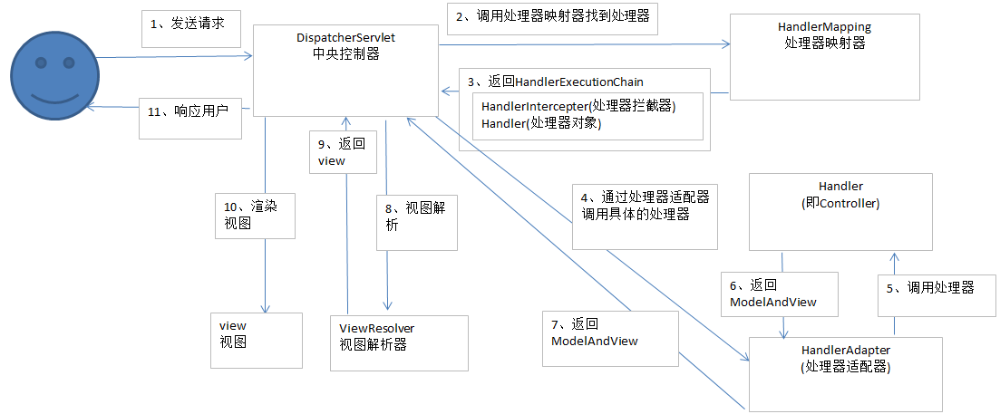
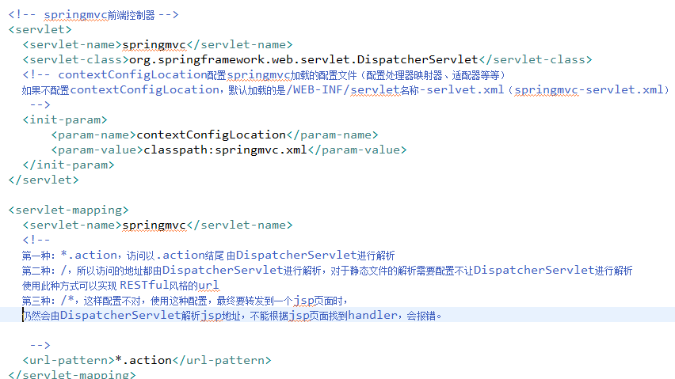

# SpringMVC
### 1、MVC与Controller,Service,Dao三层架构的关系
MVC(Model-View-Controller)其中Model是指模型数据，View指视图，Service,Dao和MVC模式是没有关系的，但是在具体实现中，model层的对象会被dao和service管理调用实现增删改查存储等，然后controller返回view。
mvc模式框架Controller（struts2、spring mvc）+View(freemarker+velocity,jstl)+Model和dao，service层（操作Model）构成了java WEB项目。

### 2、SpringMVC架构


##### 架构流程
1. 用户发送请求至前端控制器DispatcherServlet
2. DispatcherServlet收到请求调用HandlerMapping处理器映射器。
3. 处理器映射器根据请求url找到具体的处理器，生成处理器对象及处理器拦截器(如果有则生成)一并返回给DispatcherServlet。
4. DispatcherServlet通过HandlerAdapter处理器适配器调用处理器
5. 执行处理器(Controller，也叫后端控制器)。
6. Controller执行完成返回ModelAndView
7. HandlerAdapter将controller执行结果ModelAndView返回给DispatcherServlet
8. DispatcherServlet将ModelAndView传给ViewReslover视图解析器
9. ViewReslover解析后返回具体View
10. DispatcherServlet对View进行渲染视图（即将模型数据填充至视图中）。
11. DispatcherServlet响应用户

### 3、非注解配置
1. **DispatcherServlet(在web.xml中进行配置)**
在web.xml中进行配置


2. **HandlerMapping**
HandlerMapping 负责根据request请求找到对应的Handler处理器及Interceptor拦截器，将它们封装在HandlerExecutionChain 对象中给前端控制器返回。
  
   BeanNameUrlHandlerMapping：BeanNameUrl处理器映射器，根据请求的url与spring容器中定义的bean的name进行匹配，从而从spring容器中找到bean实例。
   ```
   <bean class="org.springframework.web.servlet.handler.BeanNameUrlHandlerMapping"/>
   ```
    SimpleUrlHandlerMapping：simpleUrlHandlerMapping是BeanNameUrlHandlerMapping的增强版本，它可以将url和处理器bean的id进行统一映射配置。
   ```
   <bean class="org.springframework.web.servlet.handler.SimpleUrlHandlerMapping">
       <property name="mappings">
           <props>
               <prop key="login.do">loginController</prop>　　<!--key值表示url的值，如果两者匹配，则处理交给id为loginController的类处理-->
           </props>
       </property>
    </bean>
   ```
3. **HandlerAdapter**
   HandlerAdapter会根据适配器接口对后端控制器进行包装（适配），包装后即可对处理器进行执行，通过扩展处理器适配器可以执行多种类型的处理器，这里使用了适配器设计模式。
   SimpleControllerHandlerAdapter：所有实现了org.springframework.web.servlet.mvc.Controller 接口的Bean通过此适配器进行适配、执行。（controller实现controller接口）
   ```
   <bean class="org.springframework.web.servlet.mvc.SimpleControllerHandlerAdapter" />
   ```
   HttpRequestHandlerAdapter：所有实现了org.springframework.web.HttpRequestHandler 接口的Bean通过此适配器进行适配、执行。
   ```
   <bean class="org.springframework.web.servlet.mvc.HttpRequestHandlerAdapter"/>
   ```
4. **Handler**
   ```
   <!--配置控制器-->
    <bean id="loginController" class="com.controller.LoginController">　　<!--配置自定义控制器类，这里的id值对应上面的id值，换句话说，上面的处理操作交给这里对应的LoginController类-->
        <property name="commandClass" value="com.entity.Users"></property>　　<!--配置注入类-->
    </bean>
   ```
5. **ViewResolver**
   ```
   <bean class="org.springframework.web.servlet.view.InternalResourceViewResolver">
        <property name="viewClass" value="org.springframework.web.servlet.view.JstlView" />
        <property name="prefix" value="/WEB-INF/jsp/" />
        <property name="suffix" value=".jsp" />
    </bean>
   ```

**DispatcherServlet从上边的文件中加载处理映射器、适配器、视图解析器等组件，如果不在springmvc.xml中配置，使用DispatcherServlet.properties默认加载的。**

### 注解配置
1. **DispatcherServlet不变**
2. **HandlerMapping**：对类中标记@ResquestMapping的方法进行映射，根据ResquestMapping定义的url匹配ResquestMapping标记的方法，匹配成功返回HandlerMethod对象给前端控制器，HandlerMethod对象中封装url对应的方法Method。从spring3.1版本开始，废除了DefaultAnnotationHandlerMapping的使用，推荐使用RequestMappingHandlerMapping完成注解式处理器映射。

```
<bean class="org.springframework.web.servlet.mvc.method.annotation.RequestMappingHandlerMapping"/>
```
3. **HandlerAdapter**：对标记@ResquestMapping的方法进行适配。从spring3.1版本开始，废除了AnnotationMethodHandlerAdapter的使用，推荐使用RequestMappingHandlerAdapter完成注解式处理器适配。
```
<bean class="org.springframework.web.servlet.mvc.method.annotation.RequestMappingHandlerAdapter"/>
```
***springmvc使用< mvc:annotation-driven>自动加载RequestMappingHandlerMapping和RequestMappingHandlerAdapter，可用在springmvc.xml配置文件中使用< mvc:annotation-driven>替代注解处理器和适配器的配置。注解的映射器和注解的适配器必须配对使用***

4. **Handler**
```
    <!-- 对于注解的Handler可以单个配置,实际开发中建议使用组件扫描 -->
	<!-- <bean class="cn.itcast.ssm.controller.ItemsController3" /> -->

	<!-- 可以扫描controller、service、...这里让扫描controller，指定controller的包 -->
	<context:component-scan base-package="cn.itcast.ssm.controller"></context:component-scan>
```

5. **ViewResolver**：不变

**区别：< mvc:annotation-driven>、< context:annotation-config />、＜context:component-scan/＞**
替代注解处理器和适配器的配置
启动注解，在已经在已经注册过的bean上面起作用，对于没有在spring容器中注册的bean，它并不能执行任何操作。
会启动注解驱动去扫描对应包下的bean对象并将创建它们的实例。

### Controller返回值
重定向：return "redirect:queryItem.action";
请求转发：return "forward:editItem.action";

### 参数绑定
处理器适配器在执行Handler之前需要把http请求的key/value数据绑定到Handler方法形参数上。springmvc中，接收页面提交的数据是通过方法形参来接收。而不是在controller类定义成员变更接收！！！！
**默认支持的参数类型：**
1. HttpServletRequest:通过request对象获取请求信息
2. HttpServletResponse:通过response处理响应信息
3. HttpSession:通过session对象得到session中存放的对象
4. Model/ModelMap:ModelMap是Model接口的实现类，通过Model或ModelMap向页面传递数据
```
//调用service查询商品信息
Items item = itemService.findItemById(id);
model.addAttribute("item", item);
```
注解适配器对RequestMapping标记的方法进行适配，对方法中的形参会进行参数绑定，早期springmvc采用PropertyEditor（属性编辑器）进行参数绑定将request请求的参数绑定到方法形参上，3.X之后springmvc就开始使用Converter进行参数绑定。
1. 简单类型:当请求的参数名称和处理器形参名称一致时会将请求参数与形参进行绑定。
**@RequestParam:**
value：参数名字，即入参的请求参数名字，如value=“item_id”表示请求的参数区中的名字为item_id的参数的值将传入；
required：是否必须，默认是true，表示请求中一定要有相应的参数，否则将报；
TTP Status 400 - Required Integer parameter 'XXXX' is not present
defaultValue：默认值，表示如果请求中没有同名参数时的默认值
定义如下：
public String editItem(@RequestParam(value="item_id",required=true) String id) {}
形参名称为id，但是这里使用value=" item_id"限定请求的参数名为item_id，所以页面传递参数的名必须为item_id。
注意：如果请求参数中没有item_id将跑出异常：
HTTP Status 500 - Required Integer parameter 'item_id' is not present
这里通过required=true限定item_id参数为必需传递，如果不传递则报400错误，可以使用defaultvalue设置默认值，即使required=true也可以不传item_id参数值
2. 简单pojo:将pojo对象中的属性名于传递进来的属性名对应，如果传进来的参数名称和对象中的属性名称一致则将参数值设置在pojo对象中
3. 包装pojo:包装一层
4. 自定义参数绑定：比如日期格式,需要自定义converter

**集合类**
1. 字符串数组：如checkbox，Controller中用String[]接受
2. List:List中存放对象，并将定义的List放在包装类中
3. Map:在包装类中定义Map对象，并添加get/set方法，action使用包装对象接收。

### 校验（Validation)
配置：

将validator注册到适配器中：
方式一：

方式二：如果配置文件中使用的是非注解方式编写的适配器，则这样配置

validationMessageSource.properties：该配置文件的作用就是存储校验失败时的提示文字信息的
```
item.name.length.error=商品名称在1到30个字符之间
pic.is.null=请上传图片
```
**校验规则**

```
// 商品修改提交
	@RequestMapping("/editItemSubmit")
	public String editItemSubmit(@Validated @ModelAttribute("item") Items items,BindingResult result,
			@RequestParam("pictureFile") MultipartFile[] pictureFile,Model model)
			throws Exception {
	//如果存在校验错误则转到商品修改页面
		if (result.hasErrors()) {
			List<ObjectError> errors = result.getAllErrors();
			for(ObjectError objectError:errors){
				System.out.println(objectError.getCode());
				System.out.println(objectError.getDefaultMessage());
			}
			return "item/editItem";
		}
```
1、@Validated作用就是将pojo内的注解数据校验规则(@NotNull等)生效，如果没有该注解的声明，pojo内有注解数据校验规则也不会生效
2、BindingResult对象用来获取校验失败的信息(@NotNull中的message)，与@Validated注解必须配对使用，一前一后

### 分组校验
校验规则是在pojo 制定的，而同一个pojo可以被多个Controller使用，此时会有问题，即：不同的Controller方法对同一个pojo进行校验，此时这些校验信息是共享在这不同的Controller方法中，但是实际上每个Controller方法可能需要不同的校验，在这种情况下，就需要使用分组校验来解决这种问题，
**定义分组**
```
//就是定义空的接口，接口类只作为这个分组标识来使用
public interface ValidGroup1 {

}
public interface ValidGroup2 {

}
```
**Controller**
```
public class Items {
    private Integer id;
//这里指定分组ValidGroup1，此@Size校验只适用ValidGroup1校验
    @Size(min=1,max=30,message="{item.name.length.error}",groups={ValidGroup1.class})
    private String name;

// 商品修改提交
	@RequestMapping("/editItemSubmit")
	public String editItemSubmit(@Validated(value={ValidGroup1.class}) @ModelAttribute("item") Items items,BindingResult result,
        @RequestParam("pictureFile") MultipartFile[] pictureFile,Model model)
        throws Exception {
```

### 数据回显
1. 简单数据类型
对于简单数据类型，如：Integer、String、Float等使用Model将传入的参数再放到request域实现显示。
2. pojo类型
springmvc默认支持pojo数据回显，springmvc自动将形参中的pojo重新放回request域中，request的key为pojo的类名（首字母小写），如下：
```
@RequestMapping("/editItemSubmit")
	public String editItemSubmit(Integer id,ItemsCustom itemsCustom)throws Exception{
```
springmvc自动将itemsCustom放回request，相当于调用下边的代码：
model.addAttribute("itemsCustom", itemsCustom);
如果key不是pojo的类名(首字母小写)，可以使用@ModelAttribute完成数据回显。
@ModelAttribute作用如下：
1、绑定请求参数到pojo并且暴露为模型数据传到视图页面
```
@RequestMapping("/editItemSubmit")
	public String editItemSubmit(Model model,@ModelAttribute("item") ItemsCustom itemsCustom)
```
2、将方法返回值暴露为模型数据传到视图页面
```
@ModelAttribute("itemtypes")
	public Map<String, String> getItemTypes(){
		
		Map<String, String> itemTypes = new HashMap<String,String>();
		itemTypes.put("101", "数码");
		itemTypes.put("102", "母婴");
		
		return itemTypes;
	}
```

### 异常处理
https://zhuanlan.zhihu.com/p/43058403

### Json
@RequestBody @ReponseBody
配置Json转换器：如果使用< mvc:annotation-driven /> 则不用定义这些内容。
```
<!--注解适配器 -->
<bean class="org.springframework.web.servlet.mvc.method.annotation.RequestMappingHandlerAdapter">
    <property name="messageConverters">
    <list>
        <bean class="org.springframework.http.converter.json.MappingJacksonHttpMessageConverter"></bean>
    </list>
    </property>
</bean>
```

### Rest
@PathVariable用于将请求URL中的模板变量映射到功能处理方法的参数上。
如果RequestMapping中表示为"/viewItems/{id}"，id和形参名称一致，@PathVariable不用指定名称。

### 静态资源访问
如果在DispatcherServlet中设置url-pattern为 /则必须对静态资源进行访问处理。
1. < mvc:default-servlet-handler/>
2. < mvc:resources mapping="" location="">实现对静态资源进行映射访问。

### 拦截器
配置：
方式一：（不推荐）
```
<bean
	class="org.springframework.web.servlet.handler.BeanNameUrlHandlerMapping">
	<property name="interceptors">
		<list>
			<ref bean="handlerInterceptor1"/>
			<ref bean="handlerInterceptor2"/>
		</list>
	</property>
</bean>
	<bean id="handlerInterceptor1" class="springmvc.intercapter.HandlerInterceptor1"/>
	<bean id="handlerInterceptor2" class="springmvc.intercapter.HandlerInterceptor2"/>
```
方式二：多个拦截器顺序执行
```
<!--拦截器 -->
<mvc:interceptors>
	<!--多个拦截器,顺序执行 -->
	<mvc:interceptor>
		<mvc:mapping path="/**"/>
		<bean class="cn.itcast.springmvc.filter.HandlerInterceptor1"></bean>
	</mvc:interceptor>
	<mvc:interceptor>
		<mvc:mapping path="/**"/>
		<bean class="cn.itcast.springmvc.filter.HandlerInterceptor2"></bean>
	</mvc:interceptor>
</mvc:interceptors>
```
两个拦截器都放行：
```
/*
 * preHandle方法按顺序执行，
 * postHandle和afterCompletion按拦截器配置的逆向顺序执行。
*/
HandlerInterceptor1...preHandle
HandlerInterceptor2...preHandle

HandlerInterceptor2...postHandle
HandlerInterceptor1...postHandle

HandlerInterceptor2...afterCompletion
HandlerInterceptor1...afterCompletion
```

拦截器1放行，拦截器2不放行：
```
HandlerInterceptor1...preHandle
HandlerInterceptor2...preHandle
HandlerInterceptor1...afterCompletion
```

都不放行：
`HandlerInterceptor1...preHandle`

**为什么不实现Controller或者HttpRequestHandler接口**
不使用注解时， 实现不同的接口会使用不用的HandlerAdapter。
使用注解后，使用RequestMappingHandlerAdapter完成注解式处理器适配。
不使用注解时，在HandlerMapping中定义映射关系。
使用注解后，使用@requestMapping完成映射关系。


