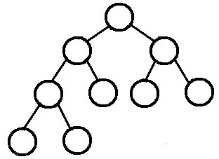
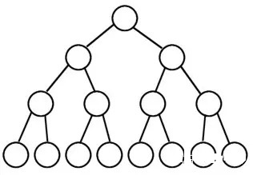
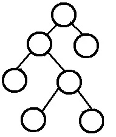

### 堆排序
完全二叉树： 除了最后一层之外的其他每一层都被完全填充，并且所有结点都保持向左对齐。

满二叉树：除了叶子结点之外的每一个结点都有两个孩子，每一层(当然包含最后一层)都被完全填充。

完满二叉树：除了叶子结点之外的每一个结点都有两个孩子结点。

堆是具有下列性质的完全二叉树
* 每个节点的值都大于或等于其左右孩子节点的值，称为大顶堆
* 每个节点的值都小于或等于其左右孩子节点的值，称为小顶堆

堆排序（Heap sort）是指利用堆这种数据结构所设计的一种排序算法。基本思想是把待排序的序列构造成一个大顶堆，此时序列的最大值就是队顶元素，把该元素放在最后，然后对剩下的 n - 1 个元素继续构造大顶堆，直到排序完成。

**算法描述**
* 将初始待排序关键字序列(R1,R2….Rn)构建成大顶堆，此堆为初始的无序区；
* 将堆顶元素R[1]与最后一个元素R[n]交换，此时得到新的无序区(R1,R2,……Rn-1)和新的有序区(Rn),且满足R[1,2…n-1]<=R[n]；
* 由于交换后新的堆顶R[1]可能违反堆的性质，因此需要对当前无序区(R1,R2,……Rn-1)调整为新堆，然后再次将R[1]与无序区最后一个元素交换，得到新的无序区(R1,R2….Rn-2)和新的有序区(Rn-1,Rn)。不断重复此过程直到有序区的元素个数为n-1，则整个排序过程完成。

**图片演示**

**代码演示**

### 参考文档
* https://blog.csdn.net/shujuelin/article/details/82423852
* https://www.cnblogs.com/onepixel/articles/7674659.html
* https://blog.csdn.net/u010853261/article/details/54884784
* https://blog.csdn.net/lingling_nice/article/details/80943231
* https://www.cnblogs.com/chengxiao/p/6194356.html
* https://www.zhihu.com/search?type=content&q=%E5%A0%86%E6%8E%92%E5%BA%8F